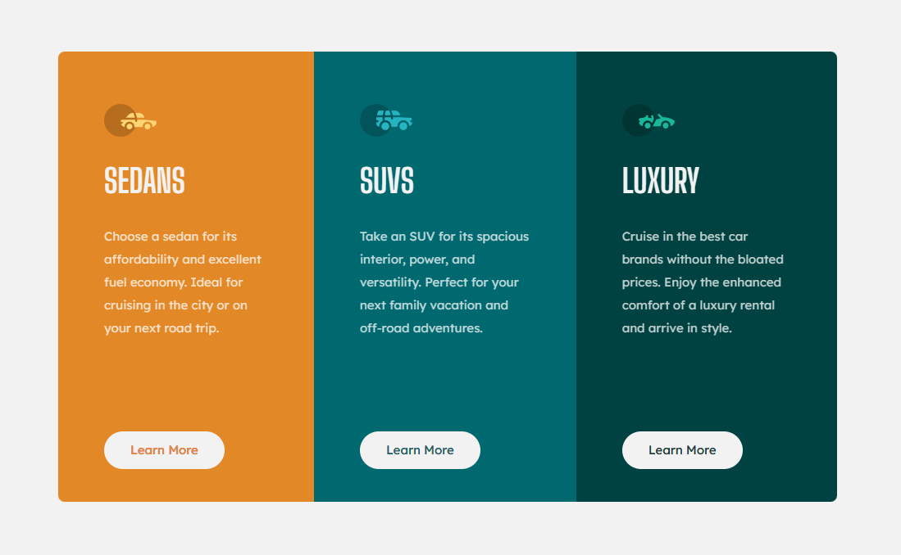
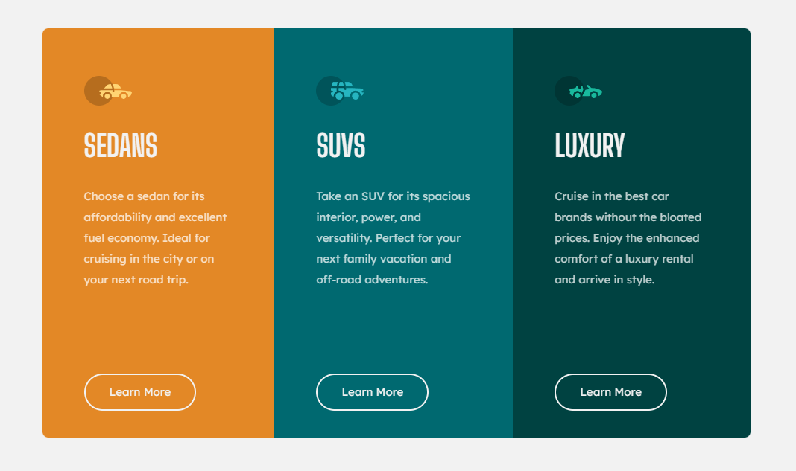

# Frontend Mentor - 3-column preview card component solution

This is a solution to the [3-column preview card component challenge on Frontend Mentor](https://www.frontendmentor.io/challenges/3column-preview-card-component-pH92eAR2-). Frontend Mentor challenges help you improve your coding skills by building realistic projects.

## Table of contents

- [Overview](#overview)
  - [The challenge](#the-challenge)
  - [Screenshot](#screenshot)
  - [Links](#links)
- [My process](#my-process)
  - [Built with](#built-with)
  - [What I learned](#what-i-learned)
  - [Continued development](#continued-development)
  - [Useful resources](#useful-resources)
- [Author](#author)
- [Acknowledgments](#acknowledgments)

## Overview

### The challenge

Users should be able to:

- View the optimal layout depending on their device's screen size
- See hover states for interactive elements

### Screenshot

 - Mobile view
 - Desktop view
 - Desktop view (while hovering anchor tag/button)

### Links

- Solution URL: [https://github.com/Grill3dCheese/FEM-3ColCard](https://github.com/Grill3dCheese/FEM-3ColCard)
- Live Site URL: [https://grill3dcheese.github.io/FEM-3ColCard/](https://grill3dcheese.github.io/FEM-3ColCard/)

## My process

### Built with

- Semantic HTML5 markup
- CSS custom properties
- Flexbox
- Mobile-first workflow

### What I learned

WOW! It's been a minute since I've completed one of these challenges or used code as I've been working through and completed a bootcamp! Learned how difficult it is to get back in the swing of things. This may not have been coded with the best optimization but am fully open to any helpful suggestions! Also may not be the most dry code so any help on how to dry it up would be awesome!

Majority of this was coded with very simple, vanilla HTML and CSS. However I did learn:

- Flexbox and page height - is still a bit tricky
- You can make text transparent, in a way, by using the mix-blend-mode CSS property! Neat! Check out the learn-more-button class to see how this was implemented!

To see how you can add code snippets, see below:

```css
.learn-more-button {
  color: #000;
  background-color: hsl(0, 0%, 95%);
  mix-blend-mode: lighten;
  text-decoration: none;
  margin: 1rem 0;
  padding: 0.75rem 2rem;
  border-radius: 2rem;
  display: inline-block;
}
```

### Continued development

Continue working on:

- Flexbox & Grid
- The wide array of CSS properties

### Useful resources

- [MDN - mix-blend-mode](https://developer.mozilla.org/en-US/docs/Web/CSS/mix-blend-mode) - Helped me understand how to blend colors!

## Author

- Website - [Keith McKenna](https://www.keithmckenna.com)
- Frontend Mentor - [@Grill3dCheese](https://www.frontendmentor.io/profile/Grill3dCheese)
- Twitter - [@keithmckenna](https://www.twitter.com/keithmckenna)

## Acknowledgments

Thanks, as always, to MDN for coming in clutch when needed!
